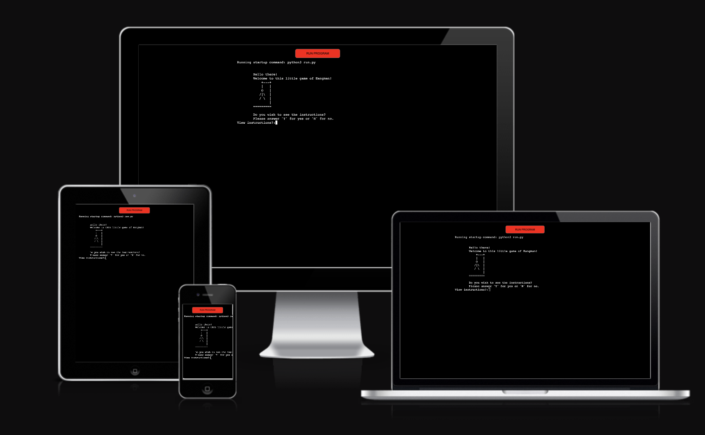
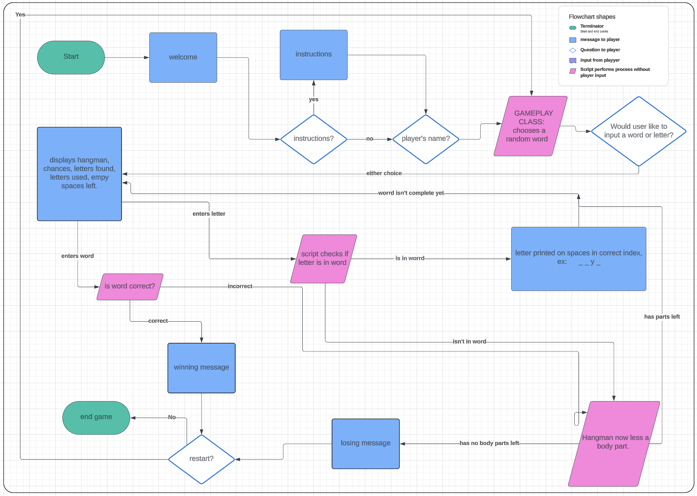

# Hangman

Hangman is a classic game where a stick figure hanging from a rope has his limbs removed for each wrong letter guessed for a word. In this online game, a stick figure is created in a python terminal using text art. 

Hangman is a fun and challenging word-guessing game that tests players' vocabulary, deductive reasoning, and luck.

## Site Goals!
- to provide a game that is both challenging and rewarding.
- to entertain the user with interactive text form the terminal
- to entice the user to play again.  

### The Code
This was the basic blueprint of the code I envisioned before I started: 

After, this is how it ended up: 

The code uses class-based object-orientated programming. 
The introduction and instructions to the game are seperate functions called at the end of the code. Then the game plays through the class "GamePlay." If the user is  winner, celebratory text art is printed. If a loser, sad text art is printed. 

Words Used: 
brick, jumpy, gent, lady, sad, over, vibes, fjord, nymph, waltz, ducks, bling, jumpy, treck, walk, lamp, post, stumped, back, bat, fowl, jordan, phlegm, halway, over, dumb, work, jawbox, kvetch, drying, jumble, dwarfing, poxy, jawbox, field, chinks, blacksmith, gunpowder.

### Features

### Features Left to Implement

- An ability to use words with double-letters. At the moment the code is not set up to handle inputs of a letter morre than once, and cannot understand how to deal with words that have a letter in it more than once.

- A leaderboard. If a google sheet were connected, the names, scores and dates could be updated and viewed. 

## Testing 

### Validator Testing 

## Deployment

- The site was deployed to Heruko App. 
The live link can be found here - https://hangman-1-game-371a683f8158.herokuapp.com/

## Credits 
### Content 

- slow printing of text in terminal: https://gist.github.com/wynand1004/5a9fd2837140fcdf26e790a112d09ac4

- hangman text art: https://gist.github.com/chrishorton/8510732aa9a80a03c829b09f12e20d9c

- walking text art: https://emojicombos.com/walk-ascii-art

- celebratorry emojis:  https://emojicombos.com/celebrate-ascii-emoji

- words used: https://puzzling.stackexchange.com/questions/8212/word-sets-with-no-repeating-letters

### Media

- The flowchart was ccreated using Lucid Chart 

