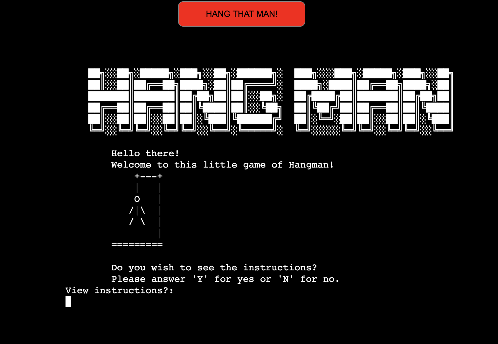
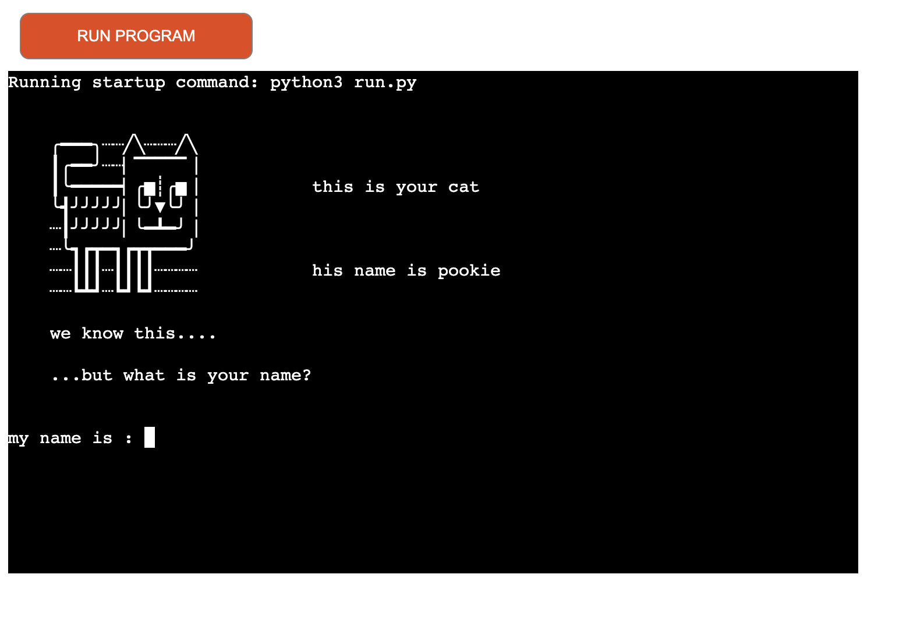
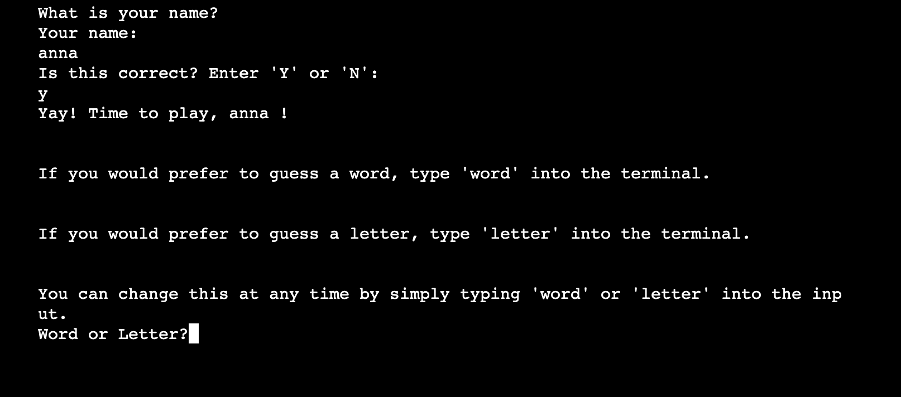
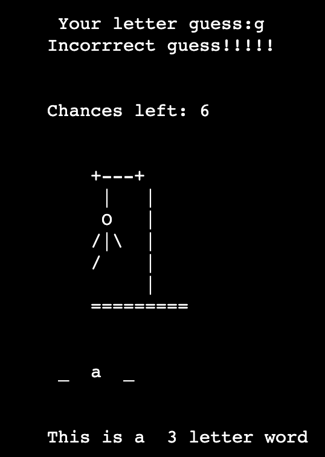
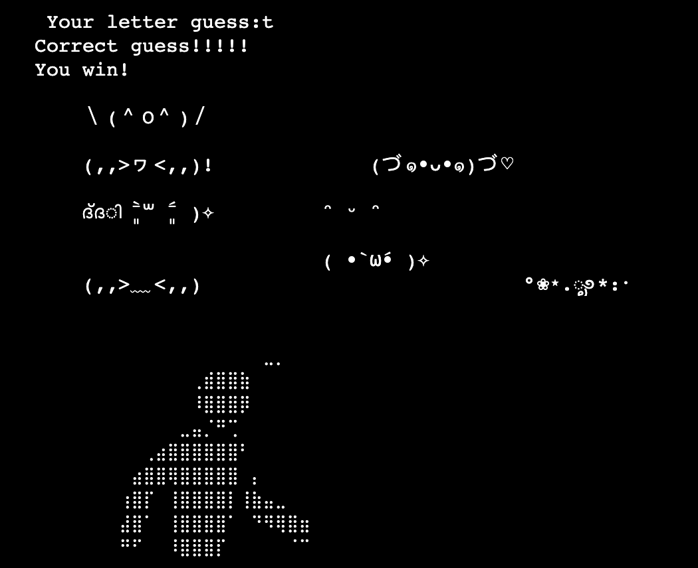
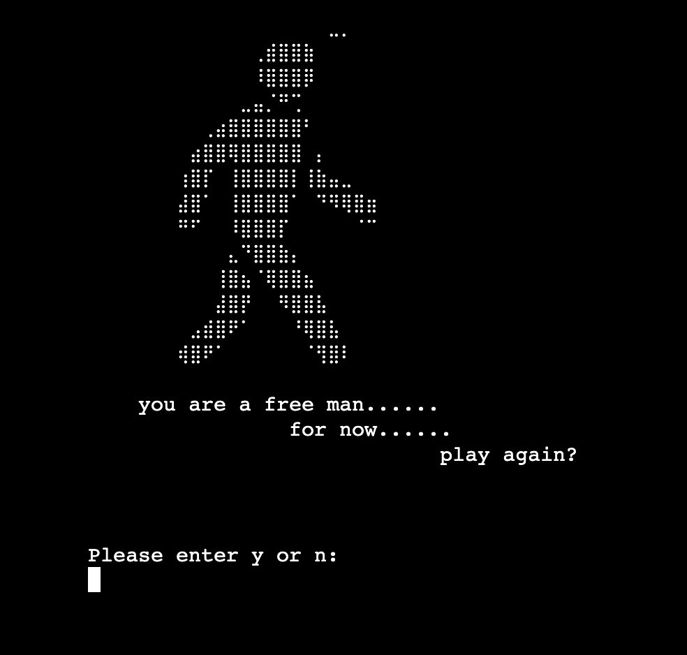
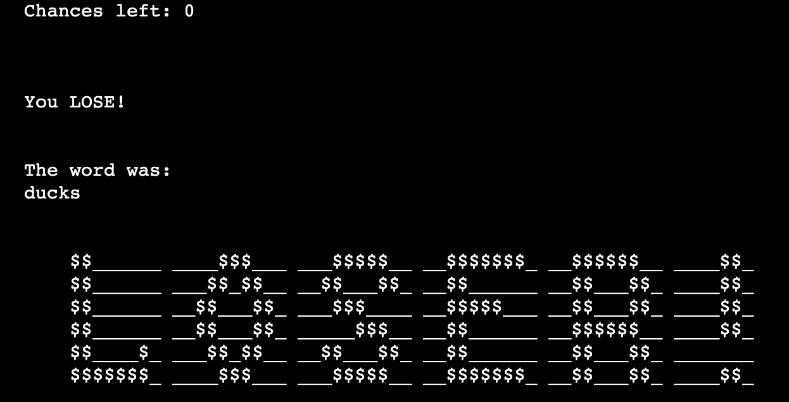
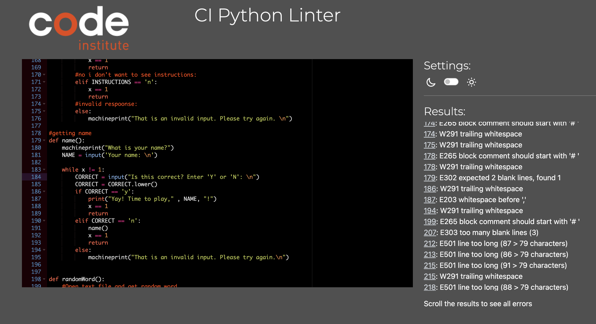

# Hangman

Hangman is a classic game where a stick figure hanging from a rope has his limbs removed for each wrong letter guessed for a word. In this online game, a stick figure is created in a python terminal using text art. 

Hangman is a fun and challenging word-guessing game that tests players' vocabulary, deductive reasoning, and luck.

The link to the game can be found [here](https://hangman-1-game-371a683f8158.herokuapp.com/)

Though a phone can be seen in this mock up, when tested, this app DOES NOT work on a phone, as the terminal is too big and doesn't accept input from phone users.

As such, this is not mobile compatible. After testing on an ipad, it does not work there either. This game is only compatible with computers. 

## Site Goals!
- to provide a game that is both challenging and rewarding.
- to entertain the user with interactive text form the terminal
- to entice the user to play again.  

### The Code
This was the basic blueprint of the code I envisioned before I started: 

After, this is how it ended up: 

The code uses class-based object-orientated programming. 
The introduction and instructions to the game are seperate functions called at the end of the code. Then the game plays through the class "GamePlay." If the user is  winner, celebratory text art is printed. If a loser, sad text art is printed. 

More context on the specifics of each functions are given in the run.py file in triple commas beneath each function. 

### Words Used: 
A variety of common and uncommon words were used with some harder words like phlegm, some strange words like "kvetch" (meaning a person who complains a great deal) and some easy words like "lamp, lady, sad, over."

brick, jumpy, gent, lady, sad, over, vibes, fjord, nymph, waltz, ducks, bling, jumpy, treck, walk, lamp, post, stumped, back, bat, fowl, jordan, phlegm, halway, over, dumb, work, jawbox, kvetch, drying, jumble, dwarfing, poxy, jawbox, field, chinks, blacksmith, gunpowder.

# Features
The user is welcomed by a sign and some nice text. The button "Hang that man" reloads the code if pressed.  

While the html content provided by Code Institute was not greatly edited, the css in 'layout.html' was edited so the terminal and button were centerred, the background color black, and the button red. Below is the prervious layout prrovided for by Code Institute. This screenshot is of a test programme I wrote from a now deleted code. 

Then the user gets to choose if she wishes to see the instruction manual. She is then asked if she wants to input words or letters. She can change this at any time using word or letter into the input. 

If the incorrect word is entered, the chances left is decreased and the little haangman loses a limb. 

If the word is correct, the winning screen is shown. If the letter is correct,the winner screen prints with happy emojis and a man walking away, indicating he is free from being hung. 

The user is the asked if she wishes to play again. If so, the game clears and restarts. 

If thhe user loses, the loser screen prints, hopefully antagonising the player enough to make them want to play again!

### Possible features Left to Implement

- An ability to use words with double-letters. At the moment the code is not set up to handle inputs of a letter morre than once, and cannot understand how to deal with words that have a letter in it more than once.

- A leaderboard. If a google sheet were connected, the names, scores and dates could be updated and viewed. The name has already been asked for in the script, but after saying welcome, it is not used again.

- Words guessed list. At the moment there is a letters guessed list, but the words guessed aren't written. 

- Two player mode. If two scores were kept a track of, two players could compete against eachother. 

## Testing 

### Validator Testing 

Validator can be found here [here](https://pep8ci.herokuapp.com/#)

There were over 500 errors when the run.py file was inputed to the CI Python Linter. I did not fix them all as most of them were small warnings like trailing white space, or that thhe comments made with # did not have a space after the hastage, appearing as #comment instead of # comment. 

However, I did fix "E501 line too long (86 > 79 characters)", E222 multiple spaces after operator "E225 missing whitespace around operator" and  "E303 too many blank lines."

## Deployment

- The site was deployed to Heruko App. 
The steps to do so are as follows: 
- Launch Heroku app
- Select new app set up, name the game, select appropriate region
- Link github repository
- In settings of the app page, add Python and Nodes.js buildpacks
- For the Code Institute template to properly work, the Config Vars MUST be set to key: PORT and value: 8000. The game will not work without this. 
- Deploy the branch, let the game build itself, and the launch. 

## Credits 
### Content 

- [slow printing of text in terminal](https://gist.github.com/wynand1004/5a9fd2837140fcdf26e790a112d09ac4)

- [hangman text art](https://gist.github.com/chrishorton/8510732aa9a80a03c829b09f12e20d9c)

- [walking text art](https://emojicombos.com/walk-ascii-art)

- [celebratorry emojis](https://emojicombos.com/celebrate-ascii-emoji)

- [words used](https://puzzling.stackexchange.com/questions/8212/word-sets-with-no-repeating-letters)

### Media

- The flowchart was ccreated using [Lucid Chart ](https://www.lucidchart.com/pages/landing?utm_source=google&utm_medium=cpc&utm_campaign=_chart_en_tier1_mixed_search_brand_exact_&km_CPC_CampaignId=1490375427&km_CPC_AdGroupID=55688909257&km_CPC_Keyword=lucidchart&km_CPC_MatchType=e&km_CPC_ExtensionID=&km_CPC_Network=g&km_CPC_AdPosition=&km_CPC_Creative=442433236001&km_CPC_TargetID=aud-809923745462:kwd-33511936169&km_CPC_Country=1007880&km_CPC_Device=c&km_CPC_placement=&km_CPC_target=&gad_source=1&gclid=Cj0KCQjw_qexBhCoARIsAFgBlet8HkOPYRznpDbwCNuXSaQdnyRH5uWypBc_8PaaMxtyow1vxM9xsQEaAobJEALw_wcB)

