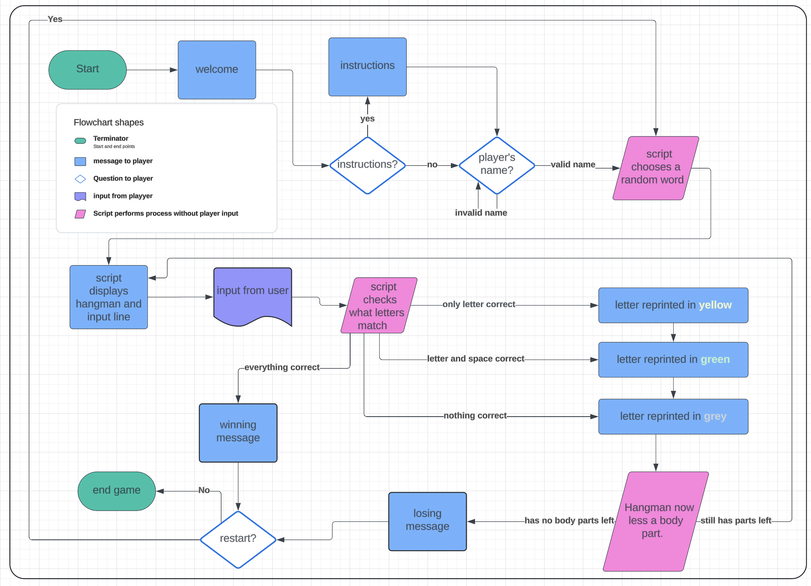

# Hangman

Hangman is a classic game where a stick figure hanging from a rope has his limbs removed for each wrong letter guessed for a word. In this online game, a stick figure is created in a python terminal using text art. The user is prompted to enter a guess letter for a 

![Responsive Mockup]
## Site Goals!
- to provide a game that is both challenging and rewarding.
- to entertain the user with interactive text form the terminal
- to entice the user to play again.  

### The Code

- __Farm Section__
  - 

### Features Left to Implement

- 

## Testing 

Using [Lighthouse](https://googlechrome.github.io/lighthouse/viewer/?psiurl=https%3A%2F%2F8000-arir2001-hughsbrews-rz235lbgdzz.ws-eu107.gitpod.io%2F&strategy=mobile&category=performance&category=accessibility&category=best-practices&category=seo&category=pwa&utm_source=lh-chrome-ext)

While everything was well done, the performance is poor due to the way the images were uploaded in large files. 

### Validator Testing 

### Unfixed Bugs

The unfixed bugs found in the validators were mainly to do with image sizing and minor syntax structure like trailing slaashes. Due to the time constrraints on this project it was deemed these could be fixed at a later date. 

The performance could be improved upon also. 

## Deployment

- The site was deployed to Heruko App. The steps to deploy are as follows: 
  - 
The live link can be found here - 

## Credits 

### Content 

- slow printing of text in terminal: https://gist.github.com/wynand1004/5a9fd2837140fcdf26e790a112d09ac4

- hangman text art: https://gist.github.com/chrishorton/8510732aa9a80a03c829b09f12e20d9c

### Media

- The flowchaart was ccreated using Lucid Chart 

